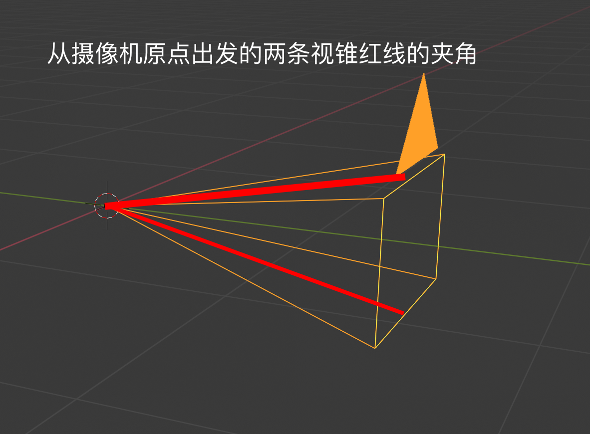

# 简述虚拟演播室中的 free-d 摄像机同步协议

# 尊重原创，请勿转载! 
作者：[图林根の烤肠](https://www.thueringerbratwurst.com)

## 前言
虚拟演播室（Virtual Studio，或者 Virtual Set）技术在上个世纪 80 年代就已经出现，它主要使用了色键（Keying）技术，摄像机追踪技术（Camera-Tracking），Mixed Reality（MR, 混合现实）等技术来将现实世界中拍摄的物体合成到虚拟场景中，从而实现一些现实环境中难以实现的效果。受限于当时的硬件环境，该技术实现的效果并不理想，并不能使观众带入到虚拟场景中。近些年来，随着计算机图形技术和硬件的不断发展（对的没错，跟5G，大数据，人工智能没关，这几项国内新闻动不动就要提几句，生怕不沾边不算新科技似的😂），通过虚拟演播室已经可以在演出直播中制作出非常惊艳的效果。从 [Vizrt 官网](https://www.vizrt.com/en/products/viz-virtual-studio) 就可以看到目前的几个实例项目。由于毕设的虚拟演播室项目需要使用 Unity 引擎而不是 Unreal 来实现摄像机的同步功能，亦或许也许是年代久远的原因，并没有发现其它关于这方面的知识介绍，随即决定简要介绍下这个通讯协议。鉴于这篇文章主要是介绍`free-d`协议，相关虚拟演播室的基础知识内容就不展开叙述了（当然，如果你或多或少听说过 free-d，也能直接说明你已经不需要了解相关知识了）。


## Free-d 协议的介绍
Free-d 摄像机追踪系统于上个世纪90年代由 BBC（就是那个擅长使用滤镜的公司🤣）开发[^Tho06]，其使用的通讯协议被称作 free-d协议。由于该协议数据结构简单且十分高效，一些 PTZ 云台摄像机，例如松下的大部分 PTZ 摄像机，都遵了该标准。 Free-d 协议的内容既可以通过 RS422/RS485 串口，也可以使用 IP 网络，通过 UDP 端口进行数据发送。通过串口发送数据的规格如下 [^FreeDGui],[^FreeDIns]

| Baud rate | 38.4 kbaud |
| Data bits | 8 (LSB first) |
| Parity | Odd |
| Stop bits | 1 |
| Total bits | 11 |

该协议的数据内容为主要由四部分组成：`消息类型（Message type）、摄像机 ID 、具体数据（该数据的组成依据消息类型而不同）、校验位（Checksum）`。该协议的字节消息发送方式为 `大端序（Big-Endian）`，校验方式是通过 `0x40` 减去消息的前面28字节（包括头部的消息类型），然后取最后两位得到。该协议的消息发送机制分为两种，一种是每秒钟 30 次的 `Stream 模式`（默认为该模式），另一种是按需发送的 `Polled mode`，该模式仅仅在请求信息的时候发送消息，但是请求的频率不能超过每秒100次，及消息请求之间需要 0.1ms 间隔。

>这个校验方法我并没有去实际验证，因为我项目中使用的摄像机我是通过 UDP/IP 方式接收数据，对传输要求不高，并不需要数据验证，如有朋友验证过，欢迎留言。

> 英文原文： The checksum is calculated by subtracting (modulo 256) each byte of the message, including the message type, from 40 (hex)

## 消息类型 Message Type
Free-d 协议的消息内容不单单发送摄像机的空间信息，它可以包含不同的数据内容。可以简单理解为不同的消息类型决定了 free-d 协议传输的数据格式有所不同，不同的消息类型分别对应了不同的使用目的。主要的消息类型可以分为：

| 类型 | 简要说明 |
| ------ | ----------- |
| Type D0 -poll/command | 用于从free-d™单元获取或者发送数据 |
| Type D1 – camera position/orientation data | 用于从free-d™单元传输摄像机位置和方向数据（摄像机同步的关键类型） |
| Type D2 – system status | 用于从free-d™单元传输系统状态。 |
| Type D3 – control parameters | 用于从free-d™单元传输或者请求控制参数 |
| Type D4 & D5 – target data | 用于从free-d™单元传输目标数据 |
| Type D6 & D7 – image data | 用于从free-d™单元传输图像数据 |
| Type D8 – EEPROM data | 用于从free-d™单元将EEPROM数据传输 |
| Type D9 – request EEPROM data | 用于请求从free-d™单元传输EEPROM数据 |
| Type DA – camera calibration data | 用于从free-d™单元传输相机校准数据 |
| Type DB – diagnostic mode | 用于将free-d™单元切换诊断模式 |

由于每一种消息类型所定义了不同的数据格式，这里碍于篇幅，只会介绍下最重要的 `Type D1 - camera position/orientation`， 该类型是我们实现摄像机同步的关键所在。其余消息类型还请读者自行查阅详细内容，具体参考链接和下载地址[^FreeDIns] 都可以在文章末尾找到。

## Type D1 - Camera position/orientation data

Type D1 的数据包一共有 `29字节` (尖括号的内容为一字节)， 包括了摄像机的八个参数数据，这八个参数主要包括摄像机的六个外部参数和两个内部参数。外部的六个参数为：摄像机的空间位置（x，y，z），摄像机自身水平（pan）、垂直（tilt）和自身旋转（roll）的数值。内部两个参数包括摄像机镜头的缩放（zoom）和对焦（focus）数值。具体结构内容如下：

| 字节 | 描述 |
| :------: | :-----------: |
| \<D1\> | 消息类型 |
| \<CA\>   | 摄像机 ID |
| \<PH\>\<PM\>\<PL\> | 水平 Pan 角度 |
| \<TH\>\<TM\>\<TL\>   | 垂直 Tilt 角度 |
| \<RH\>\<RM\>\<RL\> | 旋转 Roll 角度 |
| \<XH\>\<XM\>\<XL\> |  摄像机的 X 坐标|
| \<YH\>\<YM\>\<YL\> | 摄像机的 Y 坐标 |
| \<HH\>\<HM\>\<HL\> | 摄像机的 H 坐标 (Z 坐标) |
| \<ZH\>\<ZM\>\<ZL\> | 缩放（zoom）数值 |
| \<FH\>\<FM\>\<FL\> | 对焦时的焦点（focus）数值 |
| \<SH\>\<SL\> | 由用户保留，以做它用 |
| \<CK\> | 校验位 |

## 坐标轴的定义
摄像机的坐标轴采用右手法则，其中 x 和 y 轴确定水平面，z 轴的正数值方向指向正上方。

### 摄像机水平平移（pan）角度的定义
<figure>

<figcaption>水平角度的定义</figcaption></figure>
我们从上往下俯视摄像机（请注意上图中 xyz 坐标轴），这时候摄像机镜头以 z 轴进行的左右旋转被定义为 pan。其中，摄像机镜头光轴的正前方（y 轴）指向的方向定义为 0 度，当摄像机以 z 轴按照顺时针方向移动时，数值为正，反之则为负数。该数值由三字节（24 位）表示带正负号的浮点数值。第 23 位（数据开头从左往右第一位）是符号位 ，其中 0 表示正数，1 表示负数，并采用补码带形式表示负数。 接下来的 8 位（22 到 15）表示整数部分，剩余的 15 位（14 到 0）为小数部分。 这三个字节的数据取值范围为 -180.0 度（0xA60000）到 +180.0 度（0x5A0000）。为了容易计算，你也可以把 16 进制的数值转换成十进制，然后除以 32768 即可得到具体的角度，换句话说，就是说每一十六进制的数值，对应十进制 1/32768 角度。

>文档中注明的符号位为第23为，但是笔者通过 UPD/IP 测试（win10， Unity3D， C#）的数据却是第0位为符号位，1～8位表示正数部分，数值表示的顺序正好跟文档中说明的内容相反，具体实际情况还请读者自行确认。

### 摄像机垂直倾斜 （tilt）角度的定义
<figure>

<figcaption>倾斜角度的定义</figcaption></figure>
同上面的方法类似，当我们从摄像机的右侧观看时 （请注意上图坐标轴），摄像机围绕 x 轴转动的角度被称作倾斜角度，这其中正方向为逆时针方向（往 z 轴移动）倾斜，反之为负值。Tilt 的数值的表达方式同 pan 一样，都是以 24 位二进制表示浮点数值，第 23 位（数据开头从左往右第一位）是符号位 ，接下来的 8 位（22 到15）表示整数部分，剩余的 15 位为小数部分。 Tilt 数据取值范围为 -90.0 度（0xD30000）到 +90.0 度（0x2D0000）。简便计算方法同样为每一十六进制的数值，对应十进制 1/32768 。

### 摄像机滚动旋转 （roll）角度的定义
<figure>

<figcaption>旋转角度的定义</figcaption></figure>
同一个道理，这次我们从摄像机背面向前观察（同样需注意上图右上角的坐标轴），顺指针方向为正，反之为负值。跟 pan， tilt 同样也是采用了 24 比特来表示数值。第 23 位是符号位 ，接下来的 8 位（22 到15）表示整数部分，剩余的 15 位为小数部分。 Roll 数据取值范围为 -180.0 度（0xA60000）到 +180.0 度（0x5A0000），简要换算方法为 1/32768；

### 摄像机空间数值的定义

学过计算机图形学的朋友应该对坐标空间相当了解，这相机的 xyz 坐标空间的原点定义为摄像机追踪系统校准时的位置， xyz 轴的定义也同样为校准时摄像机自身的坐标轴，xyz 的数据均采用 24 比特来表示带符号的浮点数值，其中第 23 位是符号位 ，接下来的 17 位（22 到 6）表示整数部分，剩余的 6 位为小数部分。xyz 数据取值范围为 -131072.0 毫米（0x800000）到 +131072.0 毫米（0x7FFFFF），计算方法为 1/64 。

### 摄像机缩放（zoom）和焦点（focus）数值的定义
<figure>

<figcaption>缩放数值的定义</figcaption></figure>
摄像机的缩放数值定义为摄像机视锥的垂直夹角。可以从上图这样理解，从摄像机视原点出发，画两条沿着视锥体的线段，这两条线段的夹角被称作摄像机的缩放数值。可以把焦距理解为视锥的远平面 (far plane)，开口越大，远平面离摄像机越近，及焦距越短。远平面而相机的焦点被定义为相机镜头与对象将处于尖锐焦点之间的对象之间的距离。这两个数值均需要摄像机或是摄像机追踪系统基于镜头和相机的类型转换后才能到真正的缩放值。缩放和焦点值同样由 24 位二进制数字组成，不同的是它表示的是无符号正整数，就是说 24 位全部表示为正整数，他们的取值范围都为 1365~4095 之间。

>我目前使用的是松下的 AW-UE150 摄像机，该相机能够通过 free-d协议自动发送摄像机镜头的缩放和焦点信息，但是我仍然不清楚它们是如何编码具体的镜头数据的，目前我已经联系过松下欧洲这边的客服，但是他们给我的答复是无法从 free-d 协议中准确获得镜头的实际焦距。就是说接收到的数据和镜头实际焦距并不是线性关系，并不能直接 Mapping 获得。例如摄像机发送的焦距数据范围是 0x555~0xFFF， 镜头焦距的可变范围为 8.8mm~176mm，如果我接收到 0xAAA，我并不能推断此时的焦距为 (176-8.8)/2 = 83.6mm。官方并没给我详细的答复，应该他们的客服并不是开发人员。这里个人推断，松下发送的数据应该直接和镜头的移动距离成线性关系，不过这个还需要测试后才知道。如有朋友清楚相机具体是如何将焦距等信息编码后发送的，请来信告知，这里先表示下感谢。

## 总结
以上就是关于 free-d 协议的简要介绍，最后个人十分推荐阅读下参考链接中原版的 PDF 文件 来深入了解该协议的具体内容，这份文档里面非常详细的介绍了 free-d 系统是如何追踪摄像机的。不得不让人感叹，在当初那个年代，能够设计出这么复杂惊艳的系统，可惜碍于当时的硬件条件，该技术并没有得到大范围的推广。现如今，随着硬件水平的不断提升，游戏引擎诸如 Unreal 和 Unity3D 已经越来越多的应用到了影视领域的创作，这就使虚拟演播室技术得到了广泛推广，更加丰富了电视节目的创作，我个人也相信，在不久的将来，电视栏目的质量，尤其是直播领域，将会给观众带来更加震撼的视觉冲击体验。



## 参考文献

[^Tho06]:Graham Thomas. „Mixed reality techniques for TV and their application for onset/pre-visualisation in film production“. In: International Workshop on Mixed Reality Technology for Filmmaking (DVD), 2006. 2006.

[^FreeDGui]: Free-d Virtual Studio System Operators Guide, Vinten Radamec, <a href="https://www.yumpu.com/en/document/view/6590984/free-d-virtual-studio-system-operators-guide-vinten-radamec" target="_blank" rel="noreferrer noopener">https://www.yumpu.com/en/document/view/6590984/free-d-virtual-studio-system-operators-guide-vinten-radamec</a>

[^FreeDIns]: Vinten Radamec Free-d User Manual, Installation manual v1.4.4, <a rel="noreferrer noopener" href="https://www.manualsdir.com/manuals/641433/vinten-radamec-free-d.html?download" target="_blank">https://www.manualsdir.com/manuals/641433/vinten-radamec-free-d.html?download</a>

